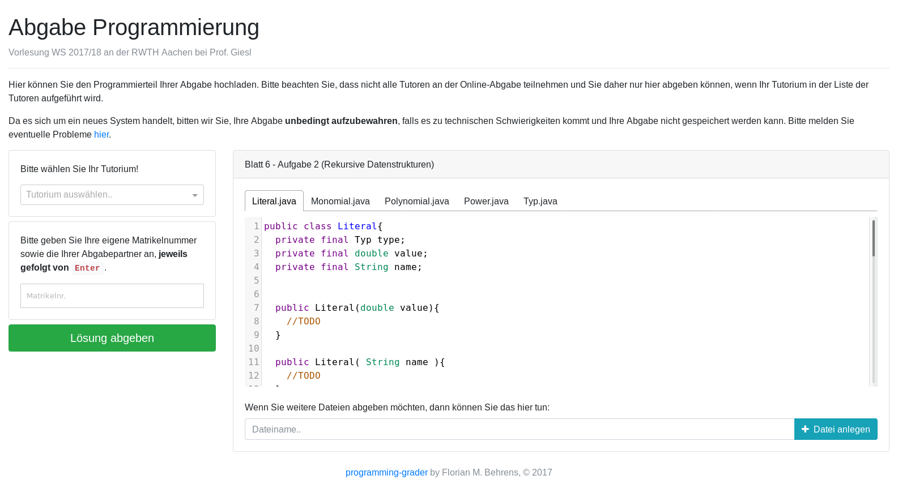

# programming-grader
A project to collect solutions to programming exercises from
students through a common web interface.

## Usage

After you have installed and configured this tool (see below), users will be
able to submit solutions. The solutions will be saved in
the directory that you specify during configuration, according
to the following scheme: `t11/123123_356348/2017-11-12_02:26:25/ex4/`
where `t11` means that the files were submitted for tutor 11, 
`123123_356348` are the matriculation numbers of the students,
`2017-11-12_02:26:25` is the time of submission and `ex4` means
that the solutions were submitted for exercise 4.

The files will also be sent as a zip archive to the email address that is specified
for the relevant tutor.

## Installation
The grader application is meant to be served by a webserver like
Apache that is configured to execute php scripts.

1. Clone the repository
1. `cd backend`
1. Install the dependencies of the backend: `php composer.phar install` (this
requires the `composer` package manager)
1. `cd ../frontend`
1. Install the dependencies of the frontend: `npm install` (this
requires the node package manager `npm`)
1. Build the frontend files: `node_modules/.bin/webpack`
1. Have the server of your choice serve the `wwwroot` directory
    - make sure php scripts are executed
    - the webserver needs to have write access to the
    directory to which the submitted files are uploaded,
    which can be configured (see below)
1. Configure the project as described below.

## Configuration

1. Copy `sample.config.php` to `config.php`
1. Adapt `config.php` according to the comments it contains.
